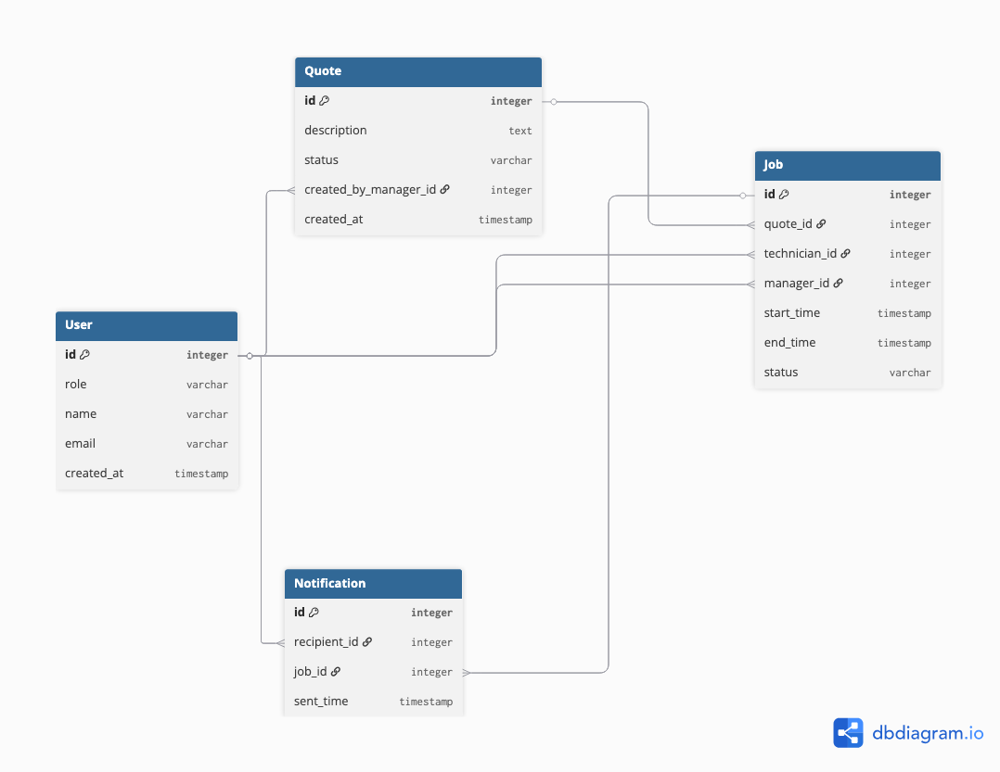

```
Table User {
  id integer pk
  role varchar  // 'manager' | 'technician'
  name varchar
}

Table Quote {
  id integer pk
  description text
  status varchar  // 'unscheduled' | 'scheduled' | 'completed'
  created_by_manager_id integer
}

Table Job {
  id integer pk
  quote_id integer unique  // one job per quote
  technician_id integer
  manager_id integer       // who assigned
  start_time timestamp
  end_time timestamp
  status varchar           // 'scheduled' | 'completed'
}

Table Notification {
  id integer pk
  recipient_id integer
  job_id integer
  sent_time timestamp
}

Ref: Quote.created_by_manager_id > User.id
Ref: Job.quote_id > Quote.id
Ref: Job.technician_id > User.id
Ref: Job.manager_id > User.id
Ref: Notification.recipient_id > User.id
Ref: Notification.job_id > Job.id

```



<ins>Decisions and Tradeoffs:</ins>

- I included a ```Notification``` db table as the choice for logging notifications due to the narrow time-frame given, also allows for notification implementations in the future.

- Even though the status of a job can either be 'scheduled' or 'completed' as the spec said which calls for a the use of a ```boolean```, I decided to go along with ```varchar``` as there could issues down the line such as job end up taking longer than expect etc., having the current status set to ```varchar``` instead opens up for further extensions down the line.

- Included ```time_start``` and ```time_end``` fields under ```Job``` because my approach to solving the issue of overlapping jobs is checking if the technician is working between the given job. In the case that a new job falls within ```time_start``` and ```time_end```, it is considered to be overlapping.